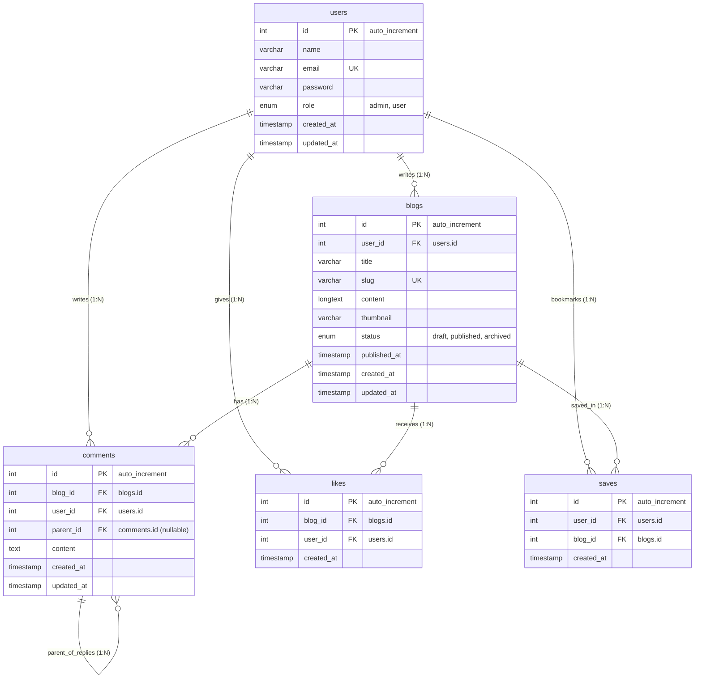

# Database Schema & Design Documentation

## 1. Overview & ERD Diagram

Sistem database menggunakan MySQL dengan Drizzle ORM untuk mengelola relasi publikasi artikel, interaksi pengguna (komentar bertingkat/reply, likes, dan bookmarks/saves).

```
┌─────────────────────┐
│        users        │
├─────────────────────┤
│ PK id               │
│    name             │
│    email            │
│    password         │
│    role             │
│    created_at       │
│    updated_at       │
└──────────┬──────────┘
           │
           │ 1
           │
           │ N
┌──────────▼──────────┐
│        blogs        │
├─────────────────────┤
│ PK id               │
│ FK user_id          │──────┐
│    title            │      │
│    slug             │      │
│    content          │      │
│    thumbnail        │      │
│    status           │      │
│    published_at     │      │
│    created_at       │      │
│    updated_at       │      │
└───────┬─────────────┘      │
        │                    │
        │ 1                  │
        │                    │
        ├───────────────┐    │
        │               │    │
        │ N             │ N  │
┌───────▼────────┐  ┌───▼────▼──────┐
│    comments    │  │     likes     │
├────────────────┤  ├───────────────┤
│ PK id          │  │ PK id         │
│ FK blog_id     │  │ FK blog_id    │
│ FK user_id     │  │ FK user_id    │
│ FK parent_id   │  │    created_at │
│    content     │  └───────────────┘
│    created_at  │
│    updated_at  │
└───────┬────────┘
        │
        │ 1
        │
        │ N
┌───────▼────────┐
│    comments    │
│    (reply)     │
└────────────────┘

┌─────────────────────┐
│        users        │
└──────────┬──────────┘
           │
           │ 1
           │ N
┌──────────▼──────────┐
│        saves        │
├─────────────────────┤
│ PK id               │
│ FK user_id          │
│ FK blog_id          │
│    created_at       │
└─────────────────────┘
```

### Mermaid Diagram



---

## 2. Tabel & Definisi Kolom

### `users`

Menyimpan akun pengguna dan autorisasi.

| Kolom        | Tipe Data                                                          | Keterangan                         |
| :----------- | :----------------------------------------------------------------- | :--------------------------------- |
| `id`         | `INT` / `BIGINT` (PK, Auto Increment)                              | Identifier unik pengguna           |
| `name`       | `VARCHAR(255)` (NOT NULL)                                          | Nama lengkap pengguna              |
| `email`      | `VARCHAR(255)` (NOT NULL, UNIQUE)                                  | Alamat email unik                  |
| `password`   | `VARCHAR(255)` (NOT NULL)                                          | Hash password (e.g. bcrypt/argon2) |
| `role`       | `VARCHAR(50)` / `ENUM('admin', 'user')` (NOT NULL, DEFAULT 'user') | Peran dalam aplikasi               |
| `created_at` | `TIMESTAMP` (DEFAULT NOW())                                        | Waktu pendaftaran                  |
| `updated_at` | `TIMESTAMP` (DEFAULT NOW() ON UPDATE NOW())                        | Waktu update profil                |

### `blogs`

Menyimpan artikel blog yang dipublikasikan oleh pengguna.

| Kolom          | Tipe Data                                                                            | Keterangan                            |
| :------------- | :----------------------------------------------------------------------------------- | :------------------------------------ |
| `id`           | `INT` / `BIGINT` (PK, Auto Increment)                                                | Identifier unik artikel               |
| `user_id`      | `INT` / `BIGINT` (FK -> `users.id`, NOT NULL)                                        | Penulis artikel                       |
| `title`        | `VARCHAR(255)` (NOT NULL)                                                            | Judul artikel                         |
| `slug`         | `VARCHAR(255)` (NOT NULL, UNIQUE)                                                    | URL slug unik                         |
| `content`      | `LONGTEXT` (NOT NULL)                                                                | Konten utama (HTML / Markdown / JSON) |
| `thumbnail`    | `VARCHAR(500)` (NULLABLE)                                                            | URL gambar sampul                     |
| `status`       | `VARCHAR(50)` / `ENUM('draft', 'published', 'archived')` (NOT NULL, DEFAULT 'draft') | Status publikasi                      |
| `published_at` | `TIMESTAMP` (NULLABLE)                                                               | Waktu rilis publik                    |
| `created_at`   | `TIMESTAMP` (DEFAULT NOW())                                                          | Waktu pembuatan artikel               |
| `updated_at`   | `TIMESTAMP` (DEFAULT NOW() ON UPDATE NOW())                                          | Waktu pengeditan artikel              |

### `comments`

Menyimpan komentar dan balasan komentar (nested replies) pada artikel.

| Kolom        | Tipe Data                                        | Keterangan                            |
| :----------- | :----------------------------------------------- | :------------------------------------ |
| `id`         | `INT` / `BIGINT` (PK, Auto Increment)            | Identifier unik komentar              |
| `blog_id`    | `INT` / `BIGINT` (FK -> `blogs.id`, NOT NULL)    | Artikel terkait                       |
| `user_id`    | `INT` / `BIGINT` (FK -> `users.id`, NOT NULL)    | Penulis komentar                      |
| `parent_id`  | `INT` / `BIGINT` (FK -> `comments.id`, NULLABLE) | ID komentar induk jika berupa balasan |
| `content`    | `TEXT` (NOT NULL)                                | Isi komentar                          |
| `created_at` | `TIMESTAMP` (DEFAULT NOW())                      | Waktu komentar dibuat                 |
| `updated_at` | `TIMESTAMP` (DEFAULT NOW() ON UPDATE NOW())      | Waktu komentar diubah                 |

### `likes`

Menyimpan catatan suka (like) artikel oleh pengguna.

| Kolom        | Tipe Data                                     | Keterangan                |
| :----------- | :-------------------------------------------- | :------------------------ |
| `id`         | `INT` / `BIGINT` (PK, Auto Increment)         | Identifier unik like      |
| `blog_id`    | `INT` / `BIGINT` (FK -> `blogs.id`, NOT NULL) | Artikel yang disukai      |
| `user_id`    | `INT` / `BIGINT` (FK -> `users.id`, NOT NULL) | Pengguna yang menyukai    |
| `created_at` | `TIMESTAMP` (DEFAULT NOW())                   | Waktu aksi like dilakukan |

- **Constraint**: Unique index pada kombinasi `(blog_id, user_id)` untuk mencegah multiple like oleh user yang sama pada artikel yang sama.

### `saves`

Menyimpan artikel yang disimpan (bookmark/save) oleh pengguna.

| Kolom        | Tipe Data                                     | Keterangan                  |
| :----------- | :-------------------------------------------- | :-------------------------- |
| `id`         | `INT` / `BIGINT` (PK, Auto Increment)         | Identifier unik bookmark    |
| `user_id`    | `INT` / `BIGINT` (FK -> `users.id`, NOT NULL) | Pengguna yang menyimpan     |
| `blog_id`    | `INT` / `BIGINT` (FK -> `blogs.id`, NOT NULL) | Artikel yang disimpan       |
| `created_at` | `TIMESTAMP` (DEFAULT NOW())                   | Waktu aksi simpan dilakukan |

- **Constraint**: Unique index pada kombinasi `(user_id, blog_id)` untuk mencegah multiple bookmark pada artikel yang sama.

---

## 3. Aturan Relasi & Integritas Referensial (Foreign Keys)

1. **`blogs.user_id` ➔ `users.id`**:
   - `ON DELETE CASCADE` atau `ON DELETE RESTRICT` (disarankan CASCADE jika akun dihapus maka artikel ikut terhapus).
2. **`comments.blog_id` ➔ `blogs.id`**:
   - `ON DELETE CASCADE` (jika blog dihapus, seluruh komentar terkait otomatis terhapus).
3. **`comments.user_id` ➔ `users.id`**:
   - `ON DELETE CASCADE`.
4. **`comments.parent_id` ➔ `comments.id`**:
   - `ON DELETE CASCADE` (jika parent comment dihapus, balasan di bawahnya ikut terhapus).
5. **`likes.blog_id` ➔ `blogs.id`** & **`likes.user_id` ➔ `users.id`**:
   - `ON DELETE CASCADE`.
6. **`saves.user_id` ➔ `users.id`** & **`saves.blog_id` ➔ `blogs.id`**:
   - `ON DELETE CASCADE`.
